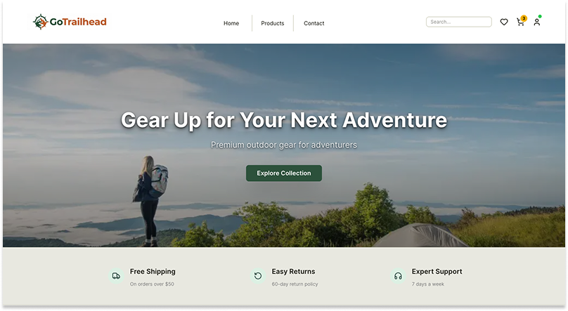

# Outdoor Gear eCommerce Application

A full-stack e-commerce application designed with Go backend and Next.js frontend, focusing on reliable order workflows, payment consistency, and deployment simplicity.



## Features

- Product catalog with search and filtering
- User authentication and account management
- Shopping cart and favorites
- Secure checkout with Stripe integration
- Order tracking and management
- Admin dashboard for inventory and orders

## Tech Stack

- **Frontend**: Next.js, TypeScript
- **Backend**: Go (Gin framework)
- **Database**: MySQL
- **Authentication**: JWT
- **Payments**: Stripe
- **Deployment**: Google Cloud (Cloud Run)

## Local Setup

### Prerequisites

- Node.js 18+
- Go 1.25+
- MySQL 8.0
- Stripe account for test mode

### Installation

1. Clone the repository:
    ```bash
    git clone https://github.com/yukaty/go-trailhead.git
    cd go-trailhead
    ```

2. Configure environment variables:
    ```bash
    cp .env.example .env
    ```

    Edit `.env` and add your Stripe keys and generate a JWT secret:
    ```bash
    go run generate_secret.go
    ```

3. Start the services with Docker Compose:
    ```bash
    docker compose up -d
    ```

4. Set up Stripe webhook for local development:
    ```bash
    stripe login
    stripe listen --forward-to localhost:8080/api/orders/webhook
    ```

    Copy the webhook signing secret and add it to `.env` as `STRIPE_WEBHOOK_SECRET`, then restart:
    ```bash
    docker compose restart backend
    ```

5. Open [http://localhost:3000](http://localhost:3000) in your browser.

## Demo Credentials

**Regular User:**
- Email: demo@example.com
- Password: password

**Admin:**
- Email: admin@example.com
- Password: password

For payment testing, see: https://docs.stripe.com/testing#cards

## Deployment

This project includes a deployment setup using GitHub Actions and GCP (Cloud Run and Cloud SQL). The workflow is currently disabled to reduce costs.

See [docs/DEPLOYMENT.md](docs/DEPLOYMENT.md) for instructions on deploying to GCP.
